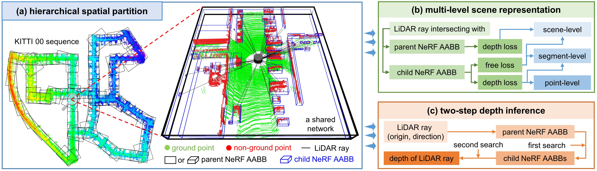

<p align="center">
  <h1 align="center"> PC-NeRF: Parent-Child Neural Radiance Fields Using Sparse LiDAR Frames in Autonomous </h1>
  <p align="center">
    <a <strong>Xiuzhong Hu</strong></a>
    ·
    <a <strong>Guangming Xiong</strong></a>
    ·    
    <a <strong>Zheng Zang</strong></a>
    ·
    <a <strong>Peng Jia</strong></a>
    ·
    <a <strong>Yuxuan Han</strong></a>        
    ·
    <a <strong>Junyi Ma</strong></a>            
  </p>
  <p align="center"><strong>Beijing Institute of Technology</strong></a>
  </h3>
  <div align="center"></div>
</p>

Our work has been accepted and the link to the paper's publication is pending.
An early name for our work was: [PC-NeRF: Parent-Child Neural Radiance Fields Using Sparse LiDAR Frames in Autonomous Driving Environments](https://arxiv.org/abs/2402.09325).
The latest name for our work is: [PC-NeRF: Parent-Child Neural Radiance Fields Using Sparse LiDAR Frames in Autonomous](https://arxiv.org/abs/2402.09325).


## Paper
```bash
@article{hu2024pc,
  title={PC-NeRF: Parent-Child Neural Radiance Fields Using Sparse LiDAR Frames in Autonomous Driving Environments},
  author={Hu, Xiuzhong and Xiong, Guangming and Zang, Zheng and Jia, Peng and Han, Yuxuan and Ma, Junyi},
  year={2024},
  eprint={2402.09325},
  archivePrefix={arXiv},
  primaryClass={cs.CV}
}
```

**The framework for our work:**
<figure>
  <div align=center>
  <div align=left><figcaption>Our PC-NeRF framework: (a) The hierarchical spatial partition divides the entire large-scale scene into large blocks, referred to as parent NeRFs. After multi-frame point cloud fusing, ground filtering, and non-ground point cloud clustering, a large block is further divided into point cloud geometric segments represented by a child NeRF. The parent NeRF shares a network with the child NeRFs within it. (b) In the multi-level scene representation, the surface intersections of the LiDAR ray with the parent and child NeRF AABBs and the LiDAR origin are used to divide the entire LiDAR ray into different line segments. The three losses on these line segments concurrently optimize the scene representation at the scene level, segment level, and point level, effectively leveraging sparse LiDAR frames. (c) For depth inference of each LiDAR ray, PC-NeRF searches in the parent NeRF AABB to locate corresponding child NeRF AABBs and then refines its inference in the child NeRF AABBs for higher precision.</figcaption>
</figure>

**The performance of our work:**
<figure>
  <div align=center>
  <div align=left><figcaption>Efficient 3D Reconstruction with PC-NeRF: Adapting to increased LiDAR frame sparsity through minimal training. The scene involves frames 1151-1200 from the KITTI 00 sequence, encompassing diverse elements like the ground, grass, walls, and vehicles. White dots in each subfigure depict individual LiDAR frame positions, and CD gauges 3D reconstruction accuracy, with smaller values indicating superior performance. As the proportion of LiDAR frames for training gradually decreases, signifying increased sparsity, PC-NeRF excels in sparse-to-dense 3D reconstruction, as evident in the last three rows of subfigures. Moreover, utilizing only 33% of LiDAR frames during training demonstrates advantages in both reconstruction quality and time consumption compared to using 50% and 80% of frames, as depicted in the first three rows of subfigures. More details are provided in Sec. IV-C.</figcaption>
</figure>


## 0. Example of Data Preprocessing for the KITTI Dataset
We use **frame sparsity** to measure the sparsity of LiDAR point cloud data in the temporal dimension. Frame sparsity represents the proportion of the test set (unavailable during training) when dividing the LiDAR dataset into training and test sets. Increased frame sparsity implies fewer LiDAR frames for training and more for model testing, posing heightened challenges across various tasks. For further details, please refer to Sec. IV-A of our [paper](https://arxiv.org/abs/2402.09325).


For further details, please refer to the [Data Pre-processing](data_preprocess.md) documentation.


## 1. Train and Test
#### Description of important parameters
##### Frame sparsity (Other frame sparsities are processed similarly)
Frame sparsity represents the proportion of the test set (unavailable during training) when dividing the LiDAR dataset into training and test sets. Increased frame sparsity implies fewer LiDAR frames for training and more for model testing, posing heightened challenges across various tasks.

the scirpt is coming soon ...

##### γ = 2 m
γ is a constant designed to represent the smooth transition interval on a LiDAR ray between the child NeRF free loss and the child NeRF depth loss
see the `expand_threshold` parameter of `inference_train` function in `./nof/render.py` file.
```python
            for i, row in enumerate(z_vals):
                expand_threshold = 2         #   
                interval = near_far_child[i]
                mask_in_child_nerf[i] = (interval[0]-expand_threshold <= row) & (row <= interval[1]+expand_threshold)      
                while (abs(torch.sum(mask_in_child_nerf[i]))==0): #                 
                    expand_threshold = expand_threshold + 0.01
                    mask_in_child_nerf[i] = (interval[0]-expand_threshold <= row) & (row <= interval[1]+expand_threshold)      
            weights_child = weights * mask_in_child_nerf.float()  # 
            z_vals_child= z_vals * mask_in_child_nerf.float()  #           
```

#### KITTI 00 sequence 
Note: 
  (1) In the following experiments the frame sparsity is 20%, and the experiments for other frame sparsities are similar.
  (2) In `./data/preprocessing/`,`./logs/kitti00/1151_1200_view/save_npy/split_child_nerf2_3/`,`./logs/maicity00/maicity_00_1/save_npy/split_child_nerf2_3/`,`./data_preprocess/kitti_pre_processed/sequence00/`, Part of the file exceeds the github recommended size for a single file, and will be organized and uploaded later.
##### OriginalNeRF
```bash
# train 
#     epoch = 1
bash ./shells/pretraining/KITTI00_originalnerf_train.bash

# eval
#     depth_inference_method = 1: use one-step depth inference
#     depth_inference_method = 2: use two-step depth inference
#     test_data_create = 0: use the test data created by ours
#     test_data_create = 1: recreate the test data
bash ./shells/pretraining/KITTI00_originalnerf_eval.bash
```
##### PC-NeRF
```bash
# train 
#     epoch = 1
bash ./shells/pretraining/KITTI00_pcnerf_train.bash

# eval
#     depth_inference_method = 1: use one-step depth inference
#     depth_inference_method = 2: use two-step depth inference
#     test_data_create = 0: use the test data created by ours
#     test_data_create = 1: recreate the test data
bash ./shells/pretraining/KITTI00_pcnerf_eval.bash
```

##### print metrc
```bash
#     inference_type: one-step: print the metric of one-step depth inference
#     inference_type: two-step: print the metric of two-step depth inference
#     version_id: version_0 or version_1
cd ./logs/kitti00/1151_1200_view/render_result/
python print_metrics.py
```

## MaiCity 00 sequence 
##### OriginalNeRF
```bash
# train 
#     epoch = 1
bash ./shells/pretraining/MaiCity00_originalnerf_train.bash

# eval
#     depth_inference_method = 1: use one-step depth inference
#     depth_inference_method = 2: use two-step depth inference
#     test_data_create = 0: use the test data created by ours
#     test_data_create = 1: recreate the test data
bash ./shells/pretraining/MaiCity00_originalnerf_eval.bash
```

##### PC-NeRF
```bash
# train 
#     epoch = 1
bash ./shells/pretraining/MaiCity00_pcnerf_train.bash

# eval
#     depth_inference_method = 1: use one-step depth inference
#     depth_inference_method = 2: use two-step depth inference
#     test_data_create = 0: use the test data created by ours
#     test_data_create = 1: recreate the test data
bash ./shells/pretraining/MaiCity00_pcnerf_eval.bash
```

##### print metrc
```bash
#     inference_type: one-step: print the metric of one-step depth inference
#     inference_type: two-step: print the metric of two-step depth inference
#     version_id: version_0 or version_1
cd ./logs/maicity00/maicity_00_1/render_result/
python print_metrics.py
```