[TOC]

# 1. KITTI Dataset Pre-processing
## 1.1 Remove Dynamic Objects
### 1.1.1 Download and Assign
Please download the KITTI dataset from [here](http://www.cvlibs.net/datasets/kitti/raw_data.php) and the Semantic KITTI dataset from [here](http://www.cvlibs.net/datasets/kitti-360/), and place them in the `data_preprocess/kitti/dataset/sequences/00` directory.
<div align=center>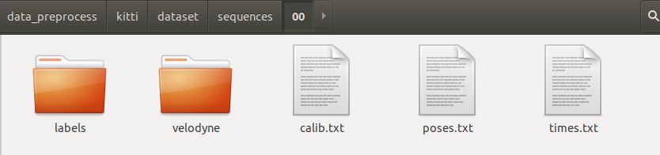</div>

### 1.1.2 Remove Dynamic Objects
First, create a directory named `pcd` within `data_preprocess/kitti/dataset/sequences/00/` to save the point cloud of the removed dynamic objects.
<div align=center>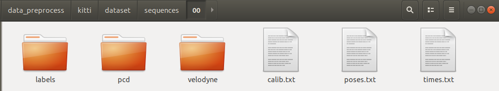</div>

Next, you can use the script `bin2pcd_folder.py` located at `data_preprocess/scripts/` to remove dynamic objects and convert the point cloud data format from `.bin` to `.pcd`. You can execute the following command:

```shell
python data_preprocess/scripts/bin2pcd_folder.py \
--input_dir data_preprocess/kitti/dataset/sequences/00/velodyne \
--output_dir data_preprocess/kitti/dataset/sequences/00/pcd
```
The script `bin2pcd_folder.py` utilizes the labels from the Semantic KITTI dataset to identify and remove the point clouds associated with labeled dynamic objects.
```python
    with open(binFileName, "rb") as f:
        byte = f.read(size_float * 4)
        while byte:
            # refer to semantic-kitti-api/config/semantic-kitti.yaml   [https://github.com/PRBonn/semantic-kitti-api]  
            if(((label[pcd_count]>=252) and (label[pcd_count]<=259))  # remove dynamic objects       
                  or (label[pcd_count]==0) # unlabeled                          
                  or (label[pcd_count]==1) # outlier                     
                  or (label[pcd_count]==10) # car
                  or (label[pcd_count]==11) # bicycle
                  or (label[pcd_count]==13) # bus
                  or (label[pcd_count]==15) # motorcycle
                  or (label[pcd_count]==16) # on-rails
                  or (label[pcd_count]==18) # truck
                  or (label[pcd_count]==20) # other-vehicle
                  or (label[pcd_count]==30) # person
                  or (label[pcd_count]==31) # bicyclist                         
                  or (label[pcd_count]==32) # motorcyclist           
                  or (label[pcd_count]==99) # other-object                  
                  or (label[pcd_count]==251) # moving  lidar-mos mod moving                     
               ):     
                byte = f.read(size_float * 4)
                pcd_count=pcd_count+1         
                continue
   
            x, y, z, intensity = struct.unpack("ffff", byte)
            list_pcd.append([x, y, z])
            byte = f.read(size_float * 4)
            pcd_count=pcd_count+1
```


### 1.1.3 One Test Scene in Our Paper

For our test scene, we have selected scan order numbers `1151` to `1200` from the `pcd` directory located at `data_preprocess/kitti/dataset/sequences/00/pcd`. These scans constitute our test scene, which we have named `KITTI-sequence00-1151-1200`. This test scene comprises a total of `50` scans and can be found in the `pcd_remove_dynamic1151_1200` directory within the same path.

<div align=center>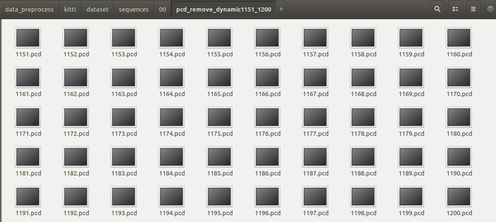</div>


## 1.2 Fuse Multi-Scan Point Cloud

To fuse the scans in the train set of the `KITTI-sequence00-1151-1200` scene, you can use the script `pointcloud_fusion.py` located at `data_preprocess/scripts/`. This script offers various parameters for customization. Some of the parameters within the `pointcloud_fusion.py` script include:

```python
    Lidar_height=0.168 
    data_start=1150    # scan order number from    data_start+1
    data_end=1200            
    root_dir="data_preprocess/kitti/dataset/sequences/00/pcd_remove_dynamic1151_1200"
    kwargs = {'root_dir': root_dir, 'data_start':data_start, 'data_end':data_end, 
                        'range_delete_x':3, 'range_delete_y':2, 'range_delete_z':1.25,
                        'interest_x':20,'interest_y':20, # interest area of single scan 
                        'pose_path':"data_preprocess/kitti/dataset/sequences/00/poses.txt",
                        'save_path':"data_preprocess/kitti_pre_processed/sequence00/1151_1200_view/",
                        'over_height':Lidar_height, 'over_low':-2
                        }   
```

You can execute the point cloud fusion script using the following command:

```bash
python data_preprocess/scripts/pointcloud_fusion.py
```

Make sure you are in the appropriate directory when running this command and that any required input data is available.
<div align=center>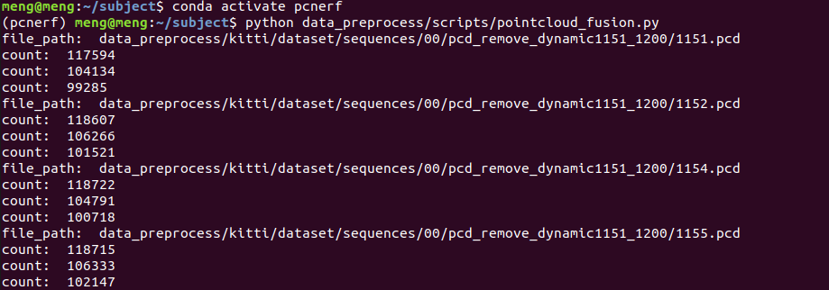</div>
......
<div align=center>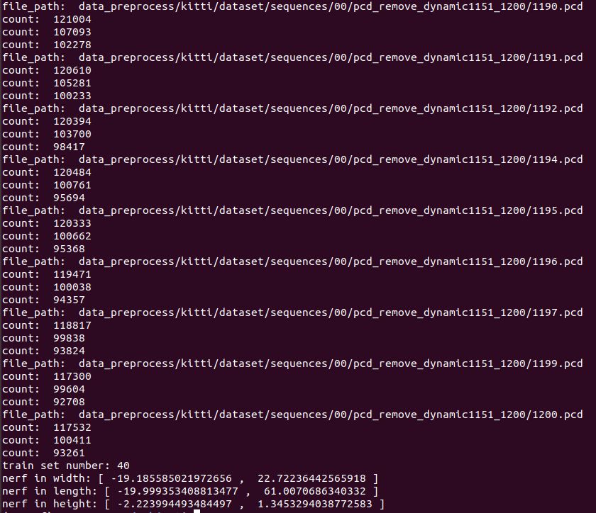</div>
we view the fusing result, the white point is the pose of different scans
<div align=center>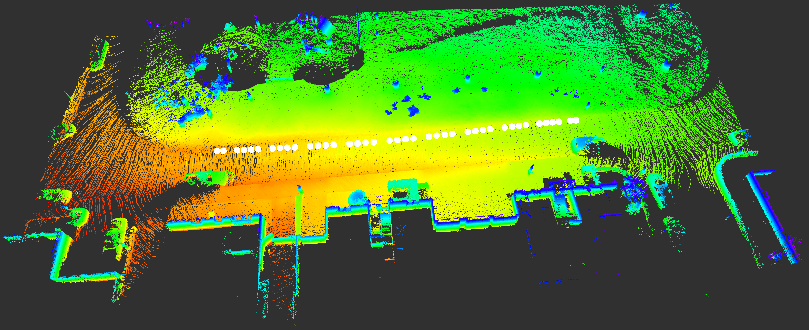</div>

## 1.3 Ground Filtering
```bash
cd data_preprocess/scripts/tool_ws
catkin_make
source devel/setup.bash
roslaunch plane_ground_filter plane_ground_filter.launch
```
Please note that you should set the `pcd_path` parameter in the `plane_ground_filter.launch` file located at `data_preprocess/scripts/tool_ws/src/plane_fit_ground_filter/` with the absolute path to the directory. During this step we have referred to [AbangLZU](https://github.com/AbangLZU/plane_fit_ground_filter).

```xml
    <arg name="pcd_read1" default="true" />
    <group if="$(arg pcd_read1)">
        <param name="pcd_path" value="/home/meng/subject/data_preprocess/kitti_pre_processed/sequence00/1151_1200_view/source.pcd" />             
        <node pkg="plane_ground_filter" name="read_pub_pcd" type="read_pub_pcd.py" output="screen">
        </node> 
    </group>
```
The ground filtering result is as follows:
<div align=center>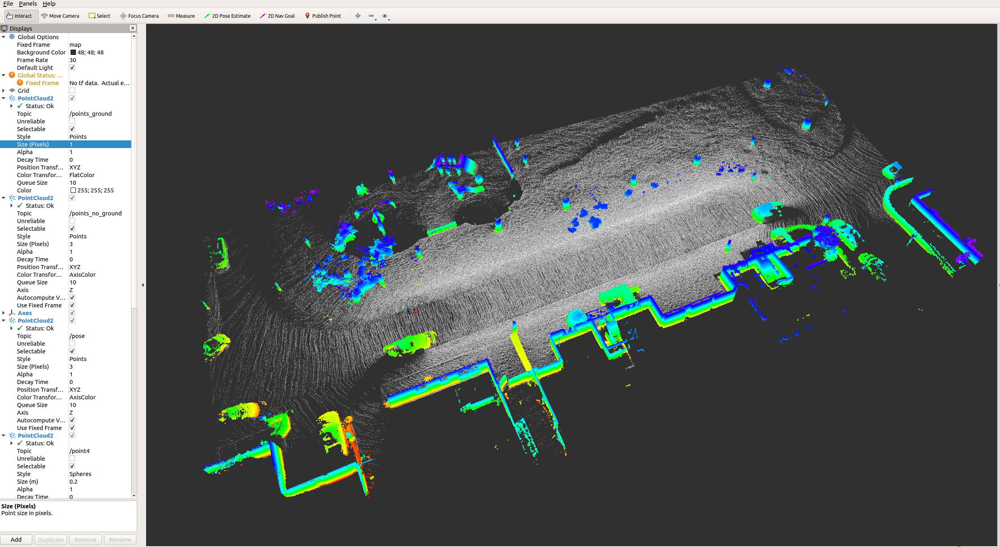</div>

You can save the ground point cloud and non-gorund point cloud as:
```bash
cd data_preprocess/kitti_pre_processed/sequence00/1151_1200_view
mkdir sub_pointcloud
cd sub_pointcloud

# Save the ground point cloud and rename it as points_ground.pcd:
rosrun pcl_ros pointcloud_to_pcd input:=/points_ground  .
# Save the non-ground point cloud and rename it as points_no_ground.pcd:
rosrun pcl_ros pointcloud_to_pcd input:=/points_no_ground  .
```
the result:
<div align=center>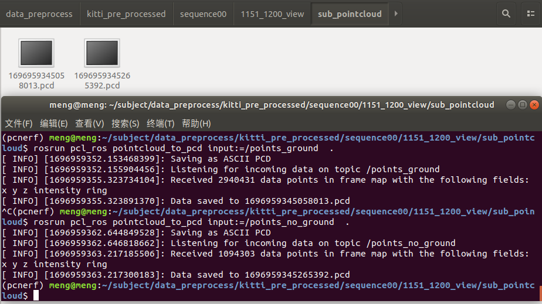</div>

After running the provided commands to rename the point clouds, you will have two files in the current directory:
<div align=center>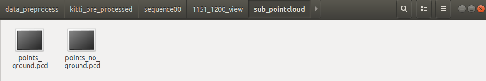</div>

## 1.4 Non-Ground Point Cloud Clustering

To perform non-ground point cloud clustering, you can create some directories to organize your results.
```bash
cd data_preprocess/kitti_pre_processed/sequence00/1151_1200_view/sub_pointcloud
mkdir no_ground_clusters
mkdir child_nerf
mkdir child_nerf2
```

Some details in [no_ground_cluster_kitti.py](data_preprocess/scripts/no_ground_cluster_kitti.py):
```python
    pcd_path = "data_preprocess/kitti_pre_processed/sequence00/1151_1200_view/sub_pointcloud/points_no_ground.pcd"        
    pcd = o3d.io.read_point_cloud(pcd_path)        
    points = np.asarray(pcd.points)
    points_num=points.shape[0]        
    folder_name = f"data_preprocess/kitti_pre_processed/sequence00/1151_1200_view/sub_pointcloud/no_ground_clusters/"            
    clusters,aabb_list = region_growing_segmentation(pcd, radius=0.35, min_cluster_size=15,max_cluster_size=points_num, folder_name=folder_name)
```

You can conduct non-ground point cloud clustering using the `no_ground_cluster_kitti.py` script with the following command:
```bash
python data_preprocess/scripts/no_ground_cluster_kitti.py
```
The script has processed the data, and the terminal output indicates that a total of 90 clusters have been generated. These clusters likely represent segmented objects or regions within the non-ground point cloud data. 
```bash
(pcnerf) meng@meng:~/subject$ python data_preprocess/scripts/no_ground_cluster_kitti.py
100%|████████████████████████████████████████████████████| 1094303/1094303 [06:41<00:00, 2725.18it/s]
uncluster point number: 396
pcd_unclusters_file_path: data_preprocess/kitti_pre_processed/sequence00/1151_1200_view/sub_pointcloud/no_ground_clusters/unclusters.pcd
len(clusters): 90
len(aabb_list): 90
sucess clusters number: 90
sucess clusters point number: 1093907
pcd_success_clusters_file_path: data_preprocess/kitti_pre_processed/sequence00/1151_1200_view/sub_pointcloud/no_ground_clusters/success_clusters.pcd
```
<div align=center>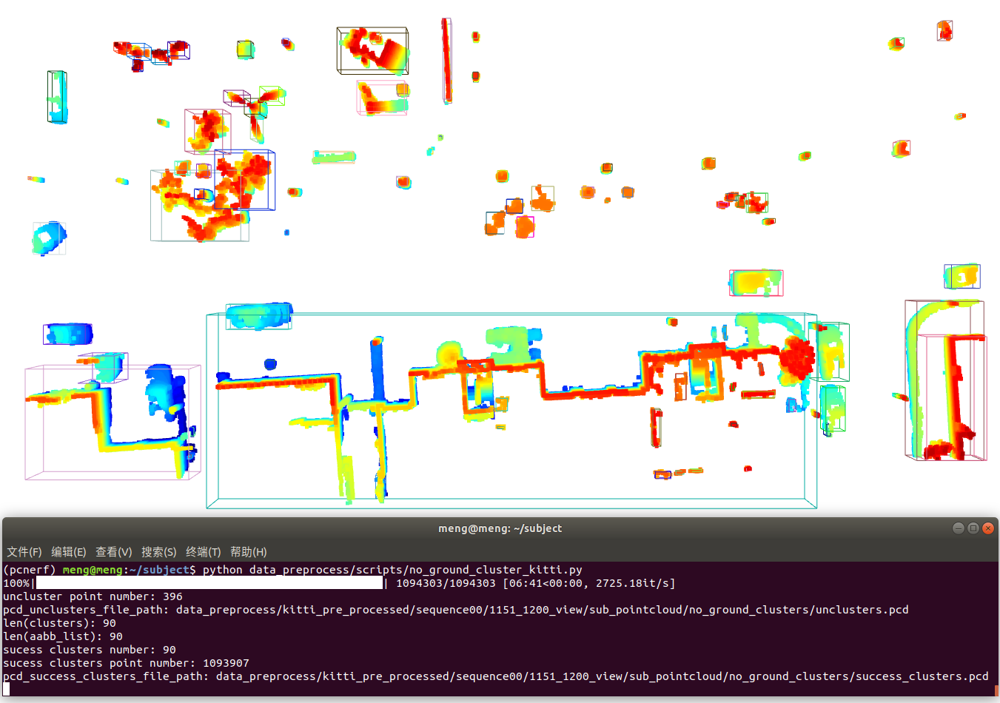</div>

<div align=center>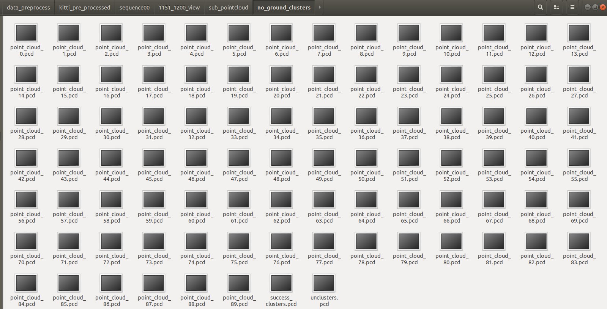</div>

## 1.5 Obtain AABBs for Child NeRFs
We moved the 90 non-ground clusters from `data_preprocess/kitti_pre_processed/sequence00/1151_1200_view/sub_pointcloud/no_ground_clusters` and the [points_ground.pcd](data_preprocess/kitti_pre_processed/sequence00/1151_1200_view/sub_pointcloud/points_ground.pcd) into `data_preprocess/kitti_pre_processed/sequence00/1151_1200_view/sub_pointcloud/child_nerf2`, resulting in a total of 91 clusters. These clusters have been sequentially renamed from `1` to `91`.

You can use the script [view_pcd_aabb1.py](data_preprocess/scripts/view_pcd_aabb1.py) to visualize the clusters and bounding boxes with the following command:

```bash
python data_preprocess/scripts/view_pcd_aabb1.py
```
This command will execute the script, allowing you to view the clusters and their associated bounding boxes.
<div align=center>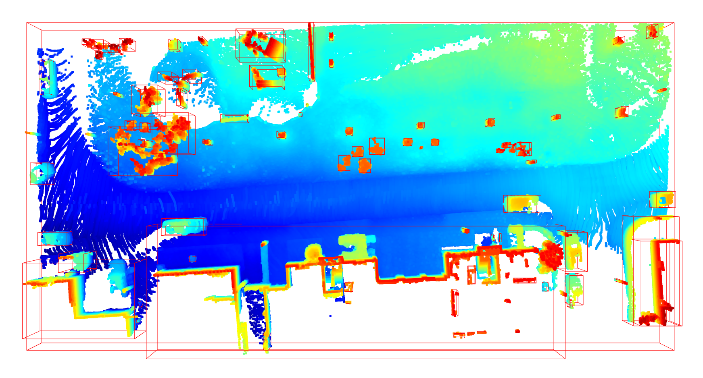</div>

You can further partition the clusters using the [split_child_nerf_xyz.py](data_preprocess/scripts/split_child_nerf_xyz.py) script with adjustable intervals, as demonstrated in the code snippet below:
```python
xy_threshold = 1  # Can be adjusted
z_threshold = 1   # Can be adjusted
split_pointcloud2(pcd_np, xy_threshold, z_threshold, output_path_prefix, points_num, i+1)
```
You can execute the script using the following command:
```bash
python data_preprocess/scripts/split_child_nerf_xyz.py
```
You can use the script [view_pcd_aabb2.py](data_preprocess/scripts/view_pcd_aabb2.py) to visualize the results. Here's the command to execute the script:
```bash
python data_preprocess/scripts/view_pcd_aabb2.py
```
<div align=center>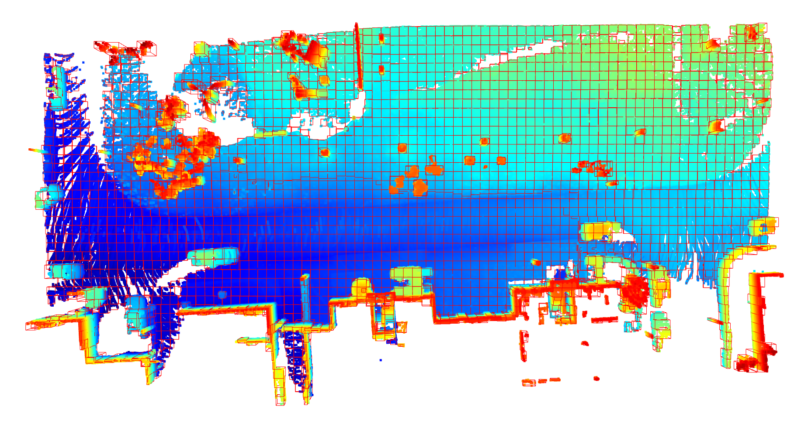</div>